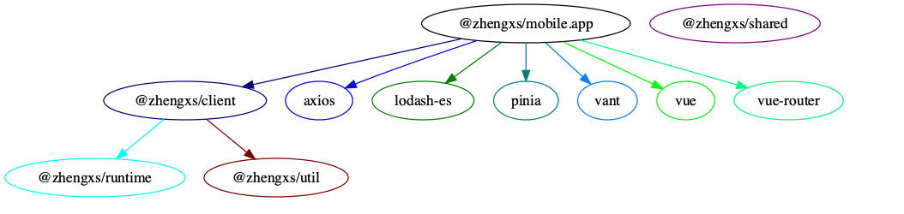

# Vue Express

[](https://www.typescriptlang.org)
[](https://github.com/prettier/prettier)

基于 [Vue 3][vuejs] 的研发解决方案，支持多种模式研发，让前端开发更加简单规范。

**依赖关系图**



- `@zhengxs/client` - 客户端封装
- `@zhengxs/runtime` - 运行时处理
- `@zhengxs/shared` - 通用类型和助手函数
- `@zhengxs/util` - 基础工具函数

## 启动项目

你需要安装 [Node.js][nodejs] 的版本为 >= 14.8+.

克隆此仓库后运行:

```bash
# 安装依赖
$ yarn install

# 启动依赖模块打包
$ yarn libs:dev

# 启动移动端应用
$ yarn apps:vant dev

# 启动跨端应用
$ yarn apps:uni dev
```

## 目录结构

应用和模块的目录结构不一样，编译方式也不一样.


### 应用目录

```sh
src/
├── assets/                          # 全局资源
├── components/                      # 全局组件
├── composables/                     # 组合函数
├── config/  
│   ├── clientAppEnhance.ts          # 应用启动前的逻辑处理
│   └── routes.ts                    # 路由配置
├── services/
│   ├── api/  
│   │   ├── data/                    # 模拟数据
│   │   ├── *.mock.ts                # 模拟函数
│   │   └── *.ts                     # 请求函数
│   ├── core/          
│   │   ├── errors.ts                # 异常类
│   │   └── http.ts                  # Axios 实例
│   ├── helpers/                     # 助手函数
│   └── types                        # 请求类型
├── shared/
│   ├── types                        # 业务类型
│   └── util                         # 公共函数
├── store/                           # 全局状态
├── views/                           # 路由视图
├── App.vue
├── main.ts
└── env.d.ts
```

### 模块目录

```sh
package/
├── src/                             # 源码目录
├── package.json
├── tsconfig.build.json              # 模块编译配置
├── tsconfig.cjs.json                # 输出 CJS 模块
└── tsconfig.esm.json                # 输出 ESM 模块
```

在 package.json 文件的 scripts 部分还有一些其他脚本可用.

## 技术栈

- [vue 3.x][vuejs]
- [vue-router 4.x](https://router.vuejs.org/)
- [pinia](https://pinia.vuejs.org/)
- [tailwindcss](https://tailwindcss.com/)
- [sass-bem](https://github.com/zgabievi/sass-bem) - 即将引入
- [normalizr](https://github.com/paularmstrong/normalizr) - 即将引入


### 支持多根工作区

`code.code-workspace` 是 VSCode 的工作区配置文件，使用工具区的好处是可以将目录进行拆分显示。

```sh
# 可以直接使用 VSCode 打开
$ code ./code.code-workspace
```

同时工作区还预设了启动配置，使用 `运行和调试` 功能直接启动项目。

可以点击[这里](https://code.visualstudio.com/docs/editor/multi-root-workspaces)了解更多工作区的介绍。

### 更好的类型提示

> 推荐安装并手动启用 [volar][volar] 插件

1. 默认停用 [vetur][vetur] 插件及相关配置.
2. 推荐启用 [volar][volar] 的低能耗 (**lowPowerMode**) 功能，为节能减排做贡献
3. 推荐禁用 [volar][volar] 的 `autoCompleteRefs` 功能，防止意外导入
4. 推荐启用 [托管模式][takeover-mode]，减少干扰.

以上所有的配置都可以点[这里](./.vscode/settings.json)修改.

## 注意

依赖关系图 使用 [package-dependency-graph](https://github.com/plantain-00/package-dependency-graph) 模块生成.

因国内网络访问 github 问题，不再内置此模块，需要的可以使用 [cnpm](https://npmmirror.com/) 进行全局安装。

## License

[MIT](./LICENSE)

[nodejs]: https://nodejs.org/
[vetur]: https://marketplace.visualstudio.com/items?itemName=octref.vetur
[volar]: https://marketplace.visualstudio.com/items?itemName=johnsoncodehk.volar
[takeover-mode]: https://vuejs.org/guide/typescript/overview.html#takeover-mode
[vuejs]: https://vuejs.org/
